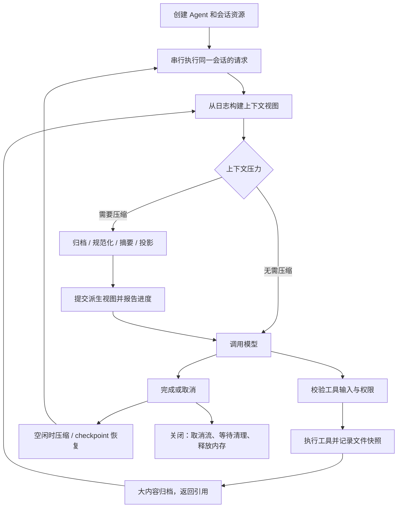

# Agent 运行流程与生命周期审查

本项目没有页面侧。本次审查与验收覆盖 SDK、Core、provider、文件/SQLite checkpoint、归档和 CLI。

## 设计基线

1. **保留原始事实，压缩派生视图。** 事件日志和归档内容是事实来源，模型上下文是有预算的投影。压缩不应静默销毁原文件或可恢复历史。
2. **资源有所有者。** 项目文件属于项目；会话、归档和私有任务属于 SDK 当前会话。关闭必须结束它拥有的工作，删除必须清理它拥有的数据。
3. **权限随委派收紧。** 引用不能变成任意路径访问凭据，取消后迟到的批准不能启动工具，畸形参数不能被替换成另一个可执行输入。
4. **恢复必须可预检。** 目标、快照、当前文件状态和日志 head 都应在变更前检查。无法恢复的文件必须明确列出。
5. **进度是实际状态。** 开始、阶段、已处理条目、完成、失败和取消需要在发生时可观察；不能以日志末尾的一条通知冒充运行中的进度。

## 已修复的问题

| 维度 | 原问题 | 本次处理 |
| --- | --- | --- |
| 使用体验 | 手动压缩只在独立生成器上发事件，订阅界面看不到 | 压缩和恢复统一进入 `subscribe()`，保留生成器消费方式 |
| 使用体验 | 自动压缩主要在结束后通知，缺少过程 | 测量、归档、规范化、摘要、投影、持久化阶段实时报告；归档可显示条目数 |
| token | 大文件先被 read_file 截断，归档拿不到尾部 | 截断前完整归档；模型仅获取短预览和引用 |
| token | 巨大的工具结果必须先进入模型才可能外置 | 超过 16 KiB 的结果在下一次模型调用前归档 |
| 上手成本 | `.lite-agent` 在项目目录外，正常运行数据读取被误拦 | 区分项目目录和当前会话 SDK 数据读范围；普通写入仍限项目 |
| 安全 | 归档引用可能被路径或符号链接替换 | 检查引用格式、当前会话索引、内容 hash 和路径组件；支持有上限的分页 |
| 健壮性 | 归档只有截断结果，无法稳定续读 | 返回 `nextOffset`；保持 Unicode 边界并保留读取预算 |
| 恢复 | 内部消息被列为 checkpoint，文本块输入没有锚点 | 新日志显式记录用户输入来源和锚点；旧日志保守兼容 |
| 恢复 | 缺快照时静默跳过，边改文件边发现错误 | 全量预检；截断快照、危险路径、外部编辑等情况明确拒绝 |
| 恢复 | 文件已经还原，日志截断失败后留下不一致 | 进程内失败时尝试回滚本次文件修改，返回恢复清单与事件 |
| 并发 | 恢复/压缩与运行、后台工作可能交错 | 维护锁和空闲检查；截断使用 expected head 检查 |
| 语义 | 可以把历史截在 tool_call 与 tool_result 中间 | 拒绝拆断未完成的工具调用链 |
| 生命周期 | close 没有覆盖前台流及等待中的人工交互 | 统一取消前台、后台和维护流；审批与输入支持 AbortSignal |
| 安全 | 取消后迟到的批准可能继续授权 | 审批队列可取消，执行入口再次检查 signal |
| 清理 | 删除会话遗留归档 | 清理对应归档及私有任务列表，保留明确共享的任务列表 |
| 安全 | provider 把无效 JSON 工具参数替换成空对象 | 解析失败即报错，不产生可执行的替代调用 |
| 健壮性 | planner 的 100ms 超时不足以等待真实模型 | 改为有界的 30s，保留取消和确定性回退；计数使用实际模型与工具前缀 |
| 可维护性 | 手动进度、锁和取消各自实现 | 抽取可复用的事件流/取消和串行审批原语，checkpoint 逻辑从 facade 分离 |

## 仍需明确的产品与运行边界

### 健壮性与安全

- **checkpoint 不是整台机器的快照。** 仅记录文件工具提交的变更。Shell、自定义工具、外部服务副作用，以及其他独立会话的变更不会自动撤销。
- **进程内回滚不等于崩溃原子事务。** 文件和数据库跨资源提交仍可能在强制退出/断电时中断。需要这种保障的部署，应使用隔离工作树/文件系统快照与独立恢复日志，不能仅依赖 `restore()`。
- **快照仍有容量限制。** 大文件内容归档与变更前文件快照是不同用途。超过快照上限的修改不会被假装成可恢复；界面能看到 `unavailableFiles`，可显式选择仅恢复对话。
- **自定义工具/provider 是可信宿主代码。** `Tool.security` 是能力声明，不是代码隔离。它们应遵守 AbortSignal；SDK 无法安全强杀任意不合作的同进程代码。需要运行不可信代码时，应放到受限进程或沙箱服务。
- **文件 checkpoint 面向单进程。** 文件身份/时间戳使多个实例能察觉日志变化，但不是跨进程事务锁。多进程运行使用 SQLite。
- **存储与脱敏是两件事。** 归档、快照和会话可能包含原文。日志脱敏不会自动加密归档。部署方仍需控制 SDK home 权限、保留周期和磁盘加密。
- **旧日志缺少新来源和 hash 信息。** 不能回填从未记录的事实；兼容读取不等于获得新的全部安全保证。

### token 与性能

- 默认路径已避免把大工具输出反复送给模型，但事实/约束、当前片段和工具说明仍占用上下文。不能承诺任意输入都能被无损压缩进任意窗口。
- 压缩前后的 token 计数可能是估算。归档字节减少比例和模型 token 费用减少比例必须分开报告。
- 文件事件重放、归档索引扫描仍适合单机规模；超长历史应继续评估 SQLite 索引、分页重放及归档检索索引。不要为了提速删除事实日志。
- 工具目录默认较大；业务应用应通过工具白名单减少无关工具。后续可以统一默认与旧版 compactor 路径，但应单独迁移并验证，避免这次修复顺带破坏兼容性。

### 上手与事件消费

- 普通调用方只需掌握 `send/run`、`subscribe`、`compact`、`listCheckpoints/restore` 和 `close`。调用方应只选择一个事件入口处理输出，避免同时消费订阅和生成器造成重复。
- 压缩无收益时应显示“已检查，无需进一步压缩”；忙碌时明确提示先结束当前工作；不能永久停在假进度条。
- 恢复前展示锚点、文件清单和不可恢复项。成功后刷新对话与 checkpoint 列表；失败后展示具体原因。
- 如业务要求“必须由人验收”，应通过权限策略约束任务完成操作；单靠提示词不能保证模型不主动标记完成。
- 本次验收以 SDK 行为、订阅事件及 CLI `/compact`、`/checkpoints`、`/restore` 入口为准，不包含页面接线或浏览器验收。

## 验证方式

正式回归测试保留在各包的 test 目录；真机脚本、合成测试数据、API 配置及报告放在代理独立工作目录，不写入仓库。验证包括实时进度、取消不提交、Unicode 续读、跨会话拒绝、SDK 数据目录访问、快照缺失/外部编辑、失败回滚、截断冲突、前台关闭和人工交互取消。构建依赖包后再测试依赖方，并检查 CLI 类型及文档构建。
